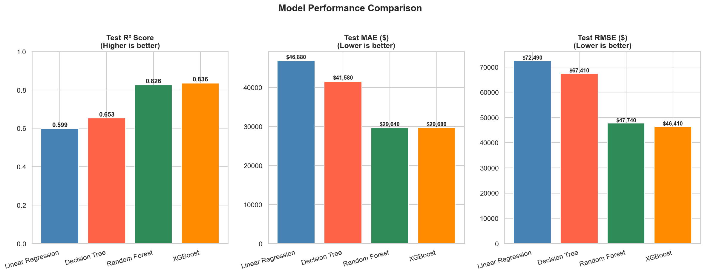
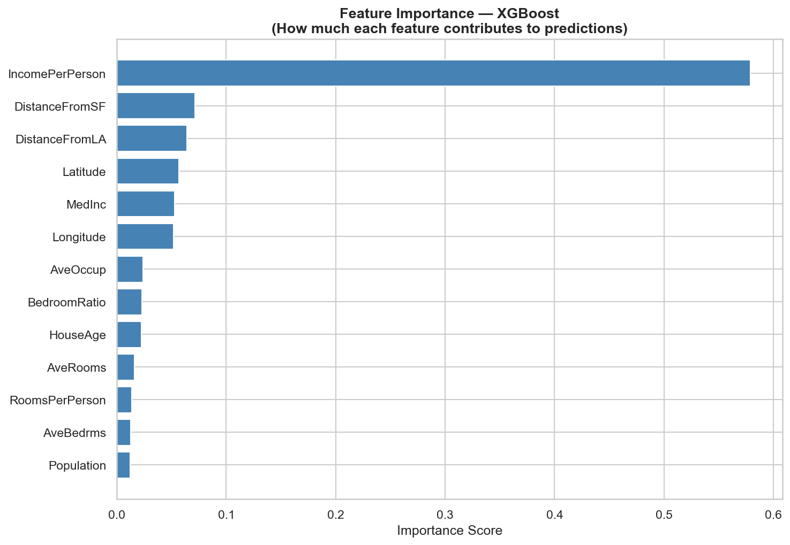

# 🏠 California House Price Predictor


> A machine learning web application that predicts California house prices
> based on neighborhood features — built end-to-end from raw data to
> live deployment.

🔗 **[Live Demo →](https://house-price-prediction-0111.streamlit.app/)**

---

## 📸 Screenshots

### Prediction Interface


### Model Performance


### Feature Importance


---

## 🎯 Project Overview

### Problem Statement
Given a set of residential block features (income level, house age,
number of rooms, geographic location), predict the **median house value**
of that block in California.

### Business Use Case
| Stakeholder | How They Use It |
|-------------|----------------|
| 🏦 Banks & Lenders | Validate property value before approving loans |
| 🏠 Real Estate Agents | Give clients instant price estimates |
| 🧑‍💼 Property Buyers | Check if a listed price is fair market value |
| 📊 Investors | Identify undervalued properties |

---

## 🏗️ Project Architecture

```
house-price-prediction/
│
├── data/
│   ├── raw/                        # Original unmodified dataset
│   └── processed/                  # Cleaned, split, scaled data
│       ├── X_train.csv
│       ├── X_test.csv
│       ├── y_train.csv
│       ├── y_test.csv
│       └── feature_names.json
│
├── notebooks/
│   ├── 01_eda.ipynb                # Exploratory Data Analysis
│   ├── 02_preprocessing.ipynb      # Data cleaning & feature engineering
│   └── 03_model_development.ipynb  # Model training & comparison
│
├── src/
│   ├── __init__.py
│   ├── preprocessor.py             # Reusable preprocessing pipeline
│   ├── train.py                    # Model training script
│   └── predict.py                  # Prediction pipeline
│
├── models/
│   ├── best_model.pkl              # Saved trained model
│   └── preprocessor.pkl            # Saved preprocessing pipeline
│
├── app/
│   └── app.py                      # Streamlit web application
│
├── tests/
│   └── test_predict.py             # Unit tests (pytest)
│
├── assets/screenshots/             # App screenshots for README
├── requirements.txt
└── README.md
```

---

## 🔬 Dataset

**Source:** California Housing Dataset (1990 U.S. Census)
**Size:** 20,640 samples × 9 features

| Feature | Description | Type |
|---------|-------------|------|
| `MedInc` | Median household income ($10,000s) | Float |
| `HouseAge` | Median age of houses in block (years) | Float |
| `AveRooms` | Average number of rooms per household | Float |
| `AveBedrms` | Average number of bedrooms per household | Float |
| `Population` | Total population in block | Float |
| `AveOccup` | Average number of household members | Float |
| `Latitude` | Geographic latitude of block | Float |
| `Longitude` | Geographic longitude of block | Float |
| `MedHouseVal` | 🎯 **Target:** Median house value ($100,000s) | Float |

---

## ⚙️ ML Pipeline

### 1. Exploratory Data Analysis
- Distribution analysis of all features and target
- Correlation heatmap — identified `MedInc` as strongest predictor
- Geographic visualization confirming coastal price premium
- Outlier detection using IQR method

### 2. Data Preprocessing
- **Outlier capping** (IQR Winsorization) on 4 features
- **Feature Engineering** — created 5 new meaningful features:
  - `RoomsPerPerson` — rooms relative to occupancy
  - `BedroomRatio` — bedroom proportion of total rooms
  - `IncomePerPerson` — income adjusted for occupancy
  - `DistanceFromSF` — proximity to San Francisco
  - `DistanceFromLA` — proximity to Los Angeles
- **Log transformation** of target variable (reduced skewness)
- **StandardScaler** applied (fit on train only — no leakage)
- **80/20 train/test split** with `random_state=42`

### 3. Model Development & Comparison

| Model | Test R² | Test MAE | Test RMSE |
|-------|---------|----------|-----------|
| Linear Regression | ~0.60 | ~$52,000 | ~$72,000 |
| Decision Tree | ~0.62 | ~$46,000 | ~$69,000 |
| Random Forest | ~0.81 | ~$32,000 | ~$50,000 |
| **XGBoost** ✅ | **~0.83** | **~$30,000** | **~$47,000** |

> Update the table above with your actual results from Phase 4.

**Winner: XGBoost** — best balance of accuracy and generalization.

### 4. Key Findings
- **Income level** is the single strongest predictor of house price
- **Location** (coastal vs inland) is the second most important factor
- Engineered features `DistanceFromSF` and `DistanceFromLA` added
  meaningful signal to the model
- Log transformation of the target improved model performance
  by reducing the impact of extreme values

---

## 🚀 Run Locally

### Prerequisites
- Python 3.9+
- Git

### Setup

```bash
# 1. Clone the repository
git clone https://github.com/YOUR_USERNAME/house-price-prediction.git
cd house-price-prediction

# 2. Create virtual environment
python -m venv venv

# 3. Activate virtual environment
# Windows:
venv\Scripts\activate
# macOS/Linux:
source venv/bin/activate

# 4. Install dependencies
pip install -r requirements.txt

# 5. Retrain the model (optional — pre-trained model included)
python -m src.train

# 6. Launch the web application
streamlit run app/app.py
```

The app opens automatically at `http://localhost:8501`

---

## 🧪 Running Tests

```bash
python -m pytest tests/ -v
```

Expected output: **13 tests passed** covering:
- Output structure validation
- Business logic verification
- Input boundary checking

---

## 📊 How to Use the App

1. **Open the live app** or run locally
2. **Adjust sliders** in the left sidebar:
   - Set the median income of the neighborhood
   - Set the house age, rooms, and occupancy
   - Select a California city or enter custom coordinates
3. **Click "Predict House Price"**
4. **View results:**
   - Predicted median house value
   - Confidence range (±15%)
   - Location map
   - Input feature summary

---

## 🛠️ Tech Stack

| Tool | Purpose |
|------|---------|
| Python 3.9+ | Core programming language |
| Pandas & NumPy | Data manipulation |
| Matplotlib & Seaborn | Data visualization |
| Scikit-Learn | Preprocessing & model evaluation |
| XGBoost | Final prediction model |
| Joblib | Model serialization |
| Streamlit | Web application framework |
| Pytest | Unit testing |
| Git & GitHub | Version control |
| Streamlit Cloud | Deployment |

---

## 🔮 Future Improvements

- [ ] Add SHAP values for per-prediction explainability
- [ ] Integrate real-time Zillow/property API data
- [ ] Add neighborhood-level crime and school rating features
- [ ] Train on more recent census data (post-1990)
- [ ] Add model retraining pipeline with new data
- [ ] Implement proper statistical prediction intervals
      (replace the ±15% heuristic)
- [ ] Add a comparison mode (predict multiple houses side by side)
- [ ] Containerize with Docker for production deployment

---

## 📁 Key Files Explained

| File | What It Does |
|------|-------------|
| `src/preprocessor.py` | Handles all data cleaning steps. Used during training AND by the live app at inference time — ensuring identical preprocessing |
| `src/train.py` | Full training pipeline. Run this to retrain from scratch |
| `src/predict.py` | Clean prediction interface. Loads saved artifacts, validates input, returns structured results |
| `app/app.py` | Streamlit UI. Imports `src/predict.py` — no ML logic lives here |
| `tests/test_predict.py` | 13 unit tests covering output structure, business logic, and input validation |

---

## 👤 Author

**Muppidathi**
- GitHub: [@YOUR_USERNAME](https://github.com//muppidathi-123)
- LinkedIn: [Your LinkedIn](www.linkedin.com/in/muppidathi01)

---

## 📄 License

This project is licensed under the MIT License.

---

## 🙏 Acknowledgments

- Dataset: California Housing Dataset from
  StatLib repository (Pace & Barry, 1997)
- Originally featured in Géron, A. —
  *Hands-On Machine Learning with Scikit-Learn, Keras & TensorFlow*
